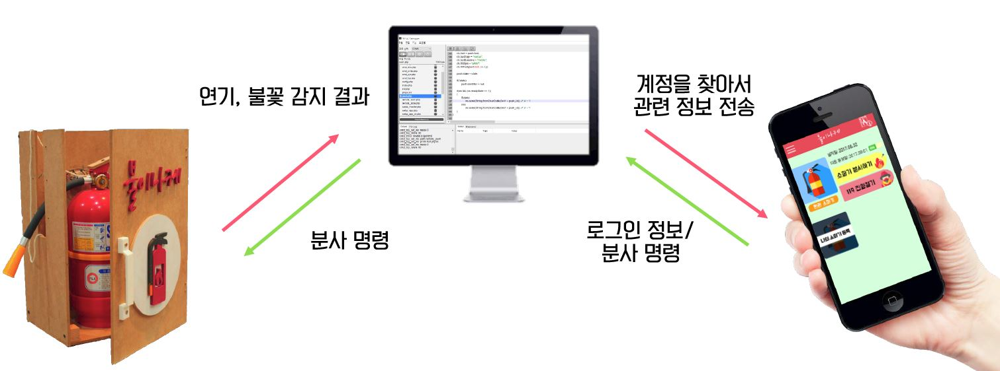

# iot-automation-fire-extinguisher
모바일로 소화기의 상태를 확인하고 자동으로 동작시키는 시스템 [자세히](./introduction)

## Functionality
- Detects smoke or fire and sends a signal to the user's app
- The user who receives the signal can decide whether to use automatic digestion
- In addition, users can use automatic digestion in an app.

## Component
- android
- google FCM
- database(mysql)
- server(php)
- arduino (additionally frame sensor, smoke sensor, wifi shield)
- autodesk

## Things to improve
- Communication problem from arduino to server
- Android Listveiw error
- Not yet implemented
  - maintain login session.
  - register iot device in database.
- Many other improvements are needed.
